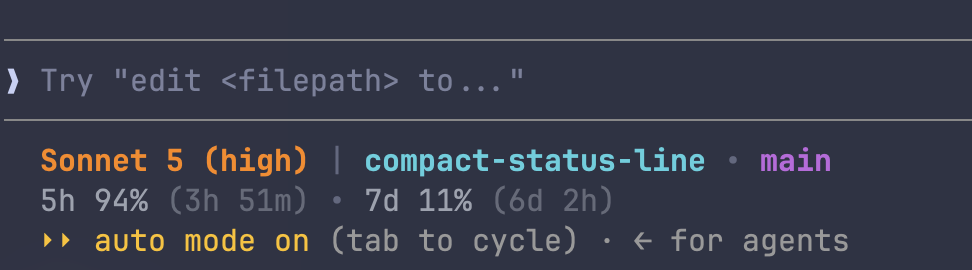

# compact-status-line

A compact, two-line status line for [Claude Code](https://claude.com/claude-code).



Line 1: model (+ effort), directory, git branch.
Line 2: 5-hour and 7-day rate limit usage, with time until each resets. Omitted entirely if no usage data is available.

## Install

```
npx compact-status-line
```

This copies `bin/statusline.sh` to `~/.claude/statusline.sh` and points `statusLine` in `~/.claude/settings.json` at it. Restart Claude Code afterwards.

To remove it:

```
npx compact-status-line --uninstall
```

## How it works

Everything — reading the hook payload, computing colors, formatting output — lives in a single file, `bin/statusline.sh`. There's no separate background process or data-fetching script.

Rate limit usage is read from the hook JSON on stdin (`.rate_limits.five_hour` / `.seven_day`), which is what recent Claude Code versions send. If that's missing, the script falls back to calling the usage API directly, caching the response for 60s.

That fallback needs an OAuth token. Rather than shelling out to the macOS Keychain on every render (slow, and can prompt for access repeatedly), the installer resolves a token **once**, at install time, and writes it to a plain file at `~/.claude/statusline-token` (mode `600`). The statusline script only ever reads that file — never the Keychain. It checks, in order:

1. `$CLAUDE_CODE_OAUTH_TOKEN` env var
2. `~/.claude/.credentials.json` (Linux / file-based Claude Code installs)
3. macOS Keychain (`Claude Code-credentials`), read once and copied to the token file

If none of those are found, the installer skips this step — the status line still works, it just won't show rate limits unless your Claude Code version already sends them on stdin. You can create the token file yourself at any time:

```
echo "your-oauth-token" > ~/.claude/statusline-token
chmod 600 ~/.claude/statusline-token
```

## Requirements

`jq`. `git` and `curl` are optional — `git` for the branch name, `curl` only for the rate-limit API fallback.
